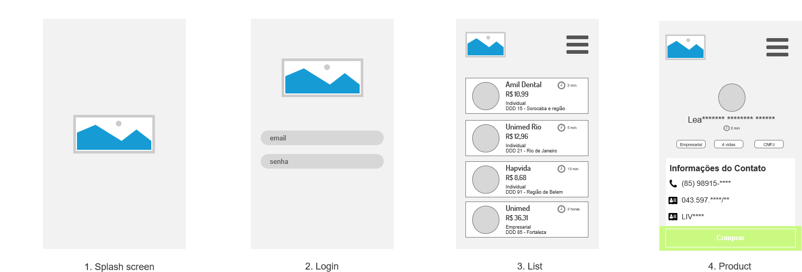

<h1 align="center">
    
</h1>

<h3 align="center">
  Desafio | Desenvolvedor React Native
</h3>

<strong>O que buscamos?</strong>

Segue o desafio que compõe a segunda fase do processo seletivo para vaga de desenvolvedor React Native na LeadMark. Busque desenvolver cada etapa mesmo que não consiga atingir 100%. Não queremos saber apenas o que você já sabe, mas o seu potencial de aprendizado.

<strong>O Desafio...</strong>

Deverá ser criado um aplicado em React Native que irá consumir os dados que estão na pasta "data" deste repositório. As seguintes telas deverão ser criadas conforme o wireframe:

1. Splash Screen
2. Login
3. List (data/list.json)
4. Product (data/product.json)

    

<strong>Como entregar o projeto?</strong>

* Criar um repositório público para o projeto.
* Mantenha um histórico de commits para o desafio
* Ao finalizar o teste, enviar email com o link do repositório para: leadmarkapp@gmail.com, cópia para: leandro.mendestavares@gmail.com
* No Readme, descrever como resolveu o desafio e os passos necessários para executar o projeto.

 
<strong>BOA SORTE!!!</strong>

